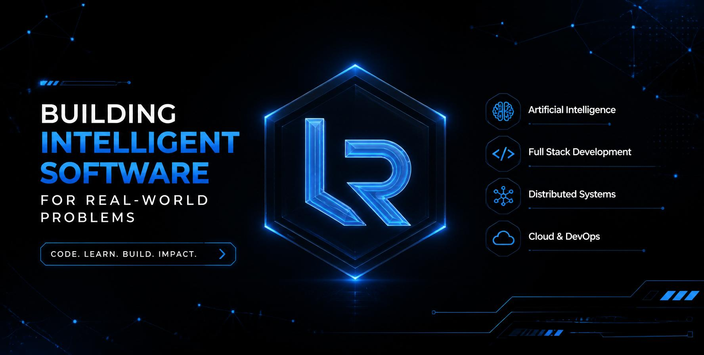
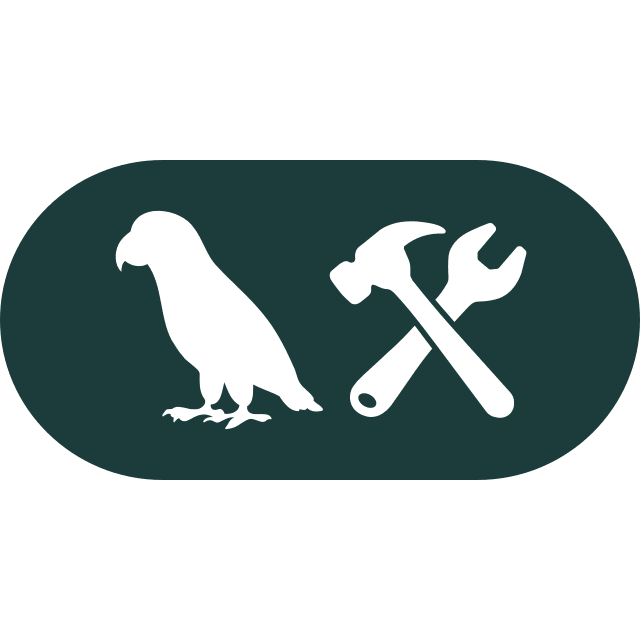
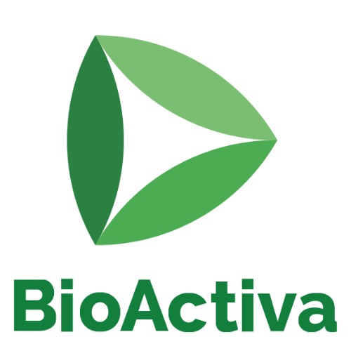
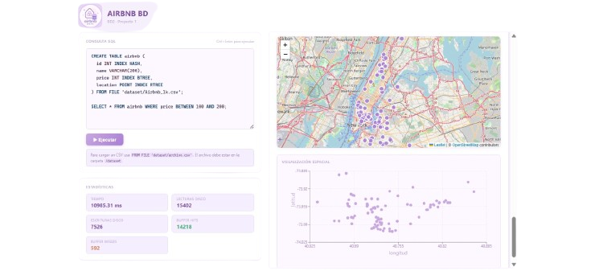

<!-- ========================================================= -->
<!--                          HERO                             -->
<!-- ========================================================= -->

  

<h1 align="center">
  Luis Anthony Romero Padilla
</h1>

<h3 align="center">
  Computer Science Student @ UTEC
</h3>

  Full Stack Developer • Artificial Intelligence • Distributed Systems

  <em>
    Building intelligent systems that solve real-world problems.
  </em>

---
<!-- ========================================================= -->
<!--                        ABOUT ME                           -->
<!-- ========================================================= -->

## 👋 About Me

I'm a **Computer Science student at UTEC** passionate about building intelligent systems, scalable web applications, and software that creates real-world impact.

My interests span **Artificial Intelligence, Full Stack Development, Distributed Systems, and Software Architecture**. I enjoy designing complete solutions—from backend services and intelligent agents to modern user interfaces—while continuously learning and improving as an engineer.

I believe that great software is not only functional but also maintainable, scalable, and built with purpose.

---

<!-- ========================================================= -->
<!--                 ENGINEERING PHILOSOPHY                    -->
<!-- ========================================================= -->

## 💡 Engineering Philosophy

> **Build software that solves real problems.**
>
> **Keep learning. Keep improving. Ship with purpose.**

---

<!-- ========================================================= -->
<!--                 CURRENTLY BUILDING                        -->
<!-- ========================================================= -->

## 🚀 Currently Building

### 🧠 Portfolio Orchestrator

An AI-powered multi-agent system that manages and evolves my professional portfolio using LangGraph.

---

### 📄 Document Intelligence Agent

Intelligent document understanding powered by OCR, Retrieval-Augmented Generation (RAG), and Large Language Models.

---

### 🌐 BioActiva Platform

Modern web platform focused on connecting volunteers, campaigns, and patients through an accessible digital experience.

---

### 📦 Market Exchange

A collaborative logistics platform that helps small and medium-sized businesses optimize cargo consolidation and reduce shipping costs.

---

<!-- ========================================================= -->
<!--                      OPEN TO                              -->
<!-- ========================================================= -->

## 🎯 Open To

- Software Engineering Internships
- Full Stack Development
- Artificial Intelligence
- Backend Engineering
- Cloud Technologies

---
<!-- ========================================================= -->
<!--                  FEATURED PROJECTS                        -->
<!-- ========================================================= -->

# 🚀 Featured Projects

Here are some of the projects I've enjoyed building the most.

 

## 🧠 Portfolio Orchestrator

AI-powered multi-agent system built with **LangGraph** that manages and evolves my professional portfolio by coordinating specialized agents for GitHub, LinkedIn, CV generation, project management, and documentation.

**Tech Stack**

`LangGraph` `Python` `FastAPI` `Docker` `PostgreSQL`

➡️ **Repository:** *(Coming Soon)*

---

## 🌐 BioActiva Platform

Modern web platform designed to connect volunteers, campaigns, and patients through an intuitive and accessible digital experience.

**Tech Stack**

`Next.js` `React` `TypeScript` `Tailwind CSS`

➡️ **Repository:** *(Private)*

---

## 📦 Market Exchange

Collaborative logistics platform focused on helping SMEs optimize cargo consolidation, reduce shipping costs, and improve freight efficiency.

**Tech Stack**

`Next.js` `FastAPI` `PostgreSQL`

➡️ **Repository:** *(Coming Soon)*

---

## 💾 MiniDBMS

Educational database management system developed in **C++**, implementing SQL parsing, query execution, indexing, and data visualization concepts.

**Tech Stack**

`C++` `SQL` `Qt`

➡️ **Repository:** *(Coming Soon)*

---
<!-- ========================================================= -->
<!--                      TECH STACK                           -->
<!-- ========================================================= -->

# 🛠️ Tech Stack

### 👨‍💻 Languages

---

### 🎨 Frontend

---

### ⚙️ Backend

---

### 🤖 AI & Machine Learning

LangGraph • LangChain • RAG • LLMs

---

### 🗄️ Databases

---

### ☁️ DevOps & Cloud

---

### 🧰 Tools

---
<!-- ========================================================= -->
<!--                    GITHUB ANALYTICS                        -->
<!-- ========================================================= -->

# 📊 GitHub Analytics

  

---
<!-- ========================================================= -->
<!--                 CONTRIBUTION ACTIVITY                     -->
<!-- ========================================================= -->

# 👾 Contribution Activity

  <picture>
    <source
      media="(prefers-color-scheme: dark)"
      srcset="https://raw.githubusercontent.com/LuixRom/LuixRom/output/pacman-contribution-graph-dark.svg?v=2"
    />
    <source
      media="(prefers-color-scheme: light)"
      srcset="https://raw.githubusercontent.com/LuixRom/LuixRom/output/pacman-contribution-graph.svg?v=2"
    />
    
  </picture>

---
